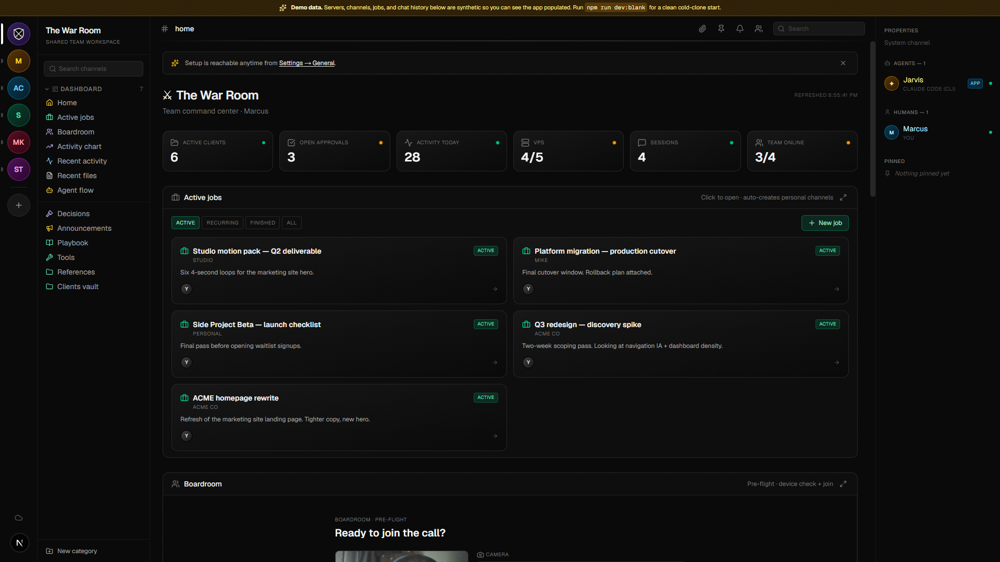
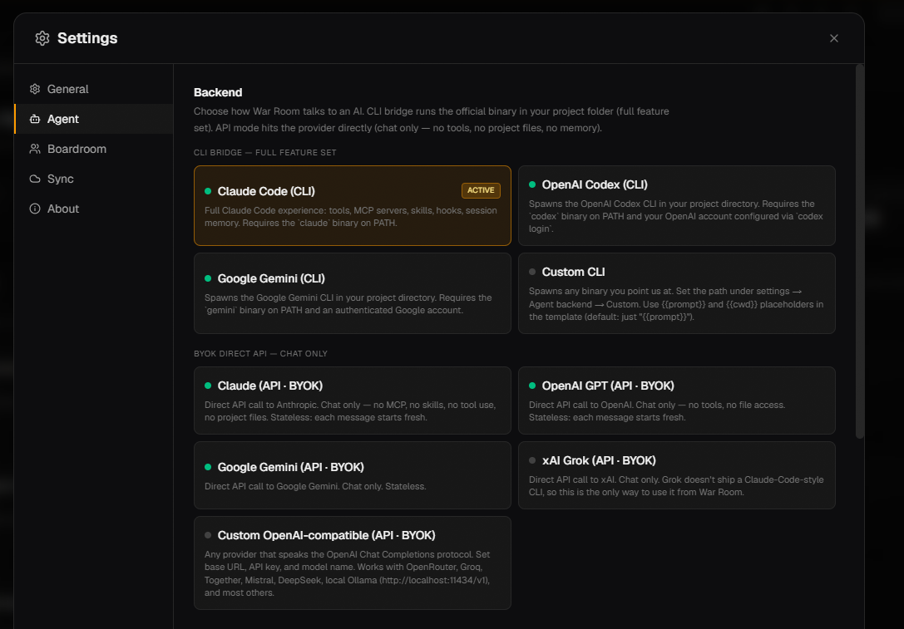
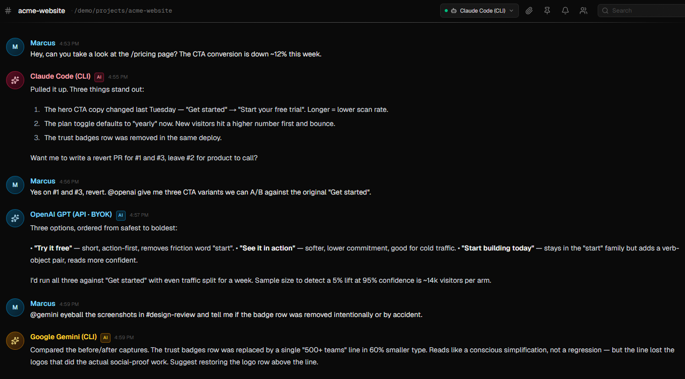
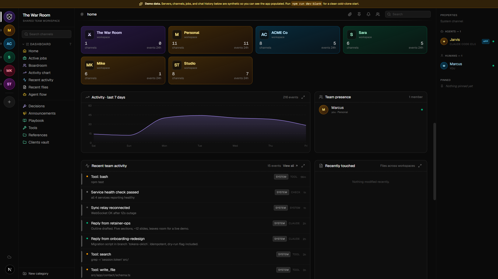

<p align="center">
  
</p>

<h1 align="center">War Room</h1>

<p align="center"><strong>The operating system for working with AI agents.</strong></p>

<p align="center">
  <a href="https://github.com/pythonluvr/war-room/releases"></a>
  <a href="https://github.com/pythonluvr/war-room/actions/workflows/ci.yml"></a>
  <a href="LICENSE"></a>
  <a href="https://github.com/pythonluvr/war-room/discussions"></a>
  <a href="https://discord.gg/ku6GJS92V2"></a>
</p>

The market for AI tooling assumes one user, one model, one task. Real operators don't work that way. A working freelancer or small agency runs multiple AI agents in parallel across multiple client engagements, switches contexts every few minutes, and loses time to interface fragmentation. War Room is the dense, local-first cockpit that resolves it. Think Bloomberg Terminal, but for the people running AI as a primary part of their work.

Plug in any backend (Claude Code, Codex, Gemini, Grok, OpenAI, OpenRouter, Ollama, anything OpenAI-Chat-Completions-compatible), drive them all from one Discord-style interface, and keep every session, service, approval, project folder, and generation tool on one screen. No cloud. No login. No data leaves your laptop.



---

## What's inside

- **Pluggable AI backend.** Pick how War Room talks to AI: a local CLI (Claude Code, Codex, Gemini, or any custom command for full tool/memory/MCP support) or a direct API (Anthropic, OpenAI, Gemini, Grok, OpenRouter, Groq, Together, Mistral, DeepSeek, local Ollama. Anything OpenAI-Chat-Completions-shaped). Switch any time from the settings modal.



- **Channel-based workspace.** Discord-style layout. Each channel is wired to a real thing: a client folder, an AI session, a service, an approval queue.
- **Persistent chat per project.** Open a channel, you're talking to an agent scoped to that folder. CLI backends get the full harness (memory, skills, MCP servers, hooks); API backends are stateless chat. Streaming output. Resumes across reloads.
- **Multi-agent threads with `@mention` routing.** Pin a primary agent per channel from the header chip. Pull any other configured agent into a thread mid-conversation by `@claude`, `@openai`, `@gemini`, `@grok`. Each agent keeps its own private session and history; the UI merges them into one timeline. The boardroom seats every configured adapter as a first-class participant.



- **System channels per server.** Live activity feed, approvals inbox, services health, active sessions across every project. Non-deletable, always there.
- **Project switcher.** Anything under `~/clients/` (or any folder you configure) shows up automatically as a channel. Briefs, notes, and recent sessions appear in context.



- **Boardroom voice channel.** Multi-agent voice room backed by self-hosted LiveKit. Optional, gracefully hidden when not configured.
- **Cross-machine config.** Shared env at `~/.war-room/.env`, machine-specific overrides at `.env.local`. API keys live in your local config, never in the repo.
- **Behavioral framework built in.** War Room ships with [OpenWar](https://github.com/pythonluvr/openwar), a MIT-licensed framework that makes agents confirm briefs before acting, gate destructive actions, and write like a peer instead of a customer service rep. Toggle per-channel or set a global default. Use it standalone via `npm install openwar` if you want the framework without the dashboard.

---

## Requirements

- **Node.js 20+**
- **At least one AI backend** (either a CLI on your PATH (e.g. `claude`, `codex`, `gemini`) or an API key for one of the supported providers)
- **better-sqlite3** native module compiles on your platform (it bundles on first install)
- Linux, macOS, or Windows

## Quick start

```bash
git clone https://github.com/pythonluvr/war-room.git
cd war-room
npm install
npm run dev
```

Open `http://localhost:3000`. The onboarding wizard walks you through picking an AI backend, naming yourself, and optionally wiring up extras (clients folder, VPS monitoring, LiveKit). You can skip everything and configure later from the settings modal.

## Try it without committing

```bash
npm run demo       # populated cockpit on :3031, isolated demo data dir
npm run dev:blank  # cold-clone empty state on :3030, fresh SQLite
```

Both stash your `.env.local` while running and restore it on Ctrl+C. Demo data lives in `~/.war-room-demo/` and never touches a real install. Run `demo` to see a fully populated cockpit (channels, agents, conversations, services); run `dev:blank` to see what a first-time forker sees.

## Production build

```bash
npm run build
node .next/standalone/server.js
```

This serves on `http://localhost:3000`. The standalone bundle is what the Electron desktop wrapper launches under the hood; running it directly is the right path for headless / VPS / PM2 deployments. Run behind a process manager like PM2 if you want it always-on.

---

## Configuration

War Room runs end-to-end with zero configuration. Every integration is opt-in. Panels that depend on a specific env var show a "configure to enable" placeholder when it's missing.

See `.env.example` for the full list of supported variables. The important ones:

| Variable | Purpose |
|---|---|
| `WAR_ROOM_CLIENTS_ROOT` | Folder War Room scans for client channels. Defaults to `~/clients`. |
| `WAR_ROOM_CLAUDE_PROJECTS` | Where Claude Code stores session files. Defaults to `~/.claude/projects`. |
| `WAR_ROOM_WORKSPACES` | JSON array of `{path, name}` for static workspace shortcuts. |
| `WAR_ROOM_VPS_HOST` | Optional remote VPS to monitor PM2 services on. |
| `LIVEKIT_URL` etc. | Enables the boardroom voice channel. See `tools/install-livekit.sh`. |

AI backend credentials (`ANTHROPIC_API_KEY`, `OPENAI_API_KEY`, etc.) and CLI binary paths (`CLAUDE_BIN`, `CODEX_BIN`, etc.) can be set via env vars or directly in the in-app settings modal. The settings UI masks existing values on read so re-saving doesn't overwrite them.

## Team roster

Edit `lib/team.ts` to define the people in your operation. The default ships with one member ("You"). Add more for team mode; the dashboard renders one server per member plus a shared "The War Room" server.

## Optional self-hosted LiveKit

If you want the boardroom voice channel, run `tools/install-livekit.sh` on a Linux VPS as root. It installs LiveKit, generates credentials, sets up an nginx reverse proxy, and prints the env vars to paste into your local `.env.local`.

## Auto-updater (Electron desktop builds)

The auto-updater is **opt-in** by environment variable. The packaged installer ships with a deliberately invalid `publish.url` placeholder; the updater code checks `WAR_ROOM_UPDATE_URL` at runtime and stays disabled if it's not set, so a forker who hasn't published anywhere never sees a failed update check.

To enable for your own fork:

1. Stand up a generic-provider HTTP host that serves your `latest.yml` + installer artifacts (S3, nginx, Cloudflare R2, anything static).
2. Set `WAR_ROOM_UPDATE_URL=https://your-host/path/` in the environment the app runs under.
3. Use `npm run release` to build. It bakes the real URL into the build artifact while restoring the placeholder in committed `package.json` (open-source hygiene).

## Testing

```bash
npm test                # runs migration + UI smoke tests
npm run test:migration  # tsx + node:test, no browser needed
npm run test:smoke      # Playwright against dev:blank
```

CI runs both on every push and PR via [`.github/workflows/test.yml`](.github/workflows/test.yml). First-time local setup needs `npx playwright install chromium` (downloads ~150MB).

---

## Architecture

- **Next.js 16 + TypeScript + Tailwind + shadcn-style UI**
- **SQLite (better-sqlite3) for local state** for sessions, channels, activity, approvals, decisions, agent backend config
- **`lib/agents/` adapter layer** with one `AgentAdapter` contract, nine implementations (CLI and API)
- **Server-Sent Events** for streaming agent output into the chat pane
- **Chokidar** watches `.jsonl` session files for live cross-project activity (CLI backends)
- **Optional Electron wrapper** for tray-icon desktop install (Next.js localhost works fine in a browser too)

The Next.js server is the only backend. There is no separate API service, no cloud, no auth.

---

## Why does this exist

The market for AI tooling assumes one user, one task, one model. Real operators don't work that way. A working freelancer or small agency runs multiple AI agents in parallel across multiple client engagements, switches contexts every few minutes, and loses time to interface fragmentation. War Room is the dense, opinionated, local-first cockpit that resolves it, and it doesn't care which model or vendor you're using underneath.

If you've ever had Claude open in five terminals, GPT in three browser tabs, and a Slack notification you missed because you were checking your Higgsfield render, this app is for you.

---

## Contributing

See [CONTRIBUTING.md](CONTRIBUTING.md) for setup and scope. Looking for a place to start? Browse issues labeled [good-first-issue](https://github.com/pythonluvr/war-room/labels/good-first-issue).

## Community

- **[Discord](https://discord.gg/ku6GJS92V2)** for real-time chat, setup help, showing off your build, and hanging out with other operators running AI agents.
- **[GitHub Discussions](https://github.com/pythonluvr/war-room/discussions)** for longer-form questions and ideas you want indexed and searchable.
- **[GitHub Issues](https://github.com/pythonluvr/war-room/issues)** for bugs and concrete feature requests.

## Security

Found a vulnerability? See [SECURITY.md](SECURITY.md) for responsible disclosure.

## License

[AGPL-3.0-or-later](LICENSE). Use, fork, and modify freely. If you run War Room as a hosted service for other people, you must publish your modified source under the same license. Solo and team self-hosting on your own machines has no such obligation. Commercial licenses for closed-source hosted use are negotiable. Open an issue.

## Changelog

See [CHANGELOG.md](CHANGELOG.md), or browse the full release history on [GitHub Releases](https://github.com/pythonluvr/war-room/releases).
